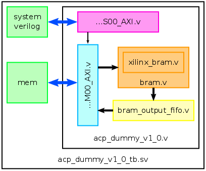

# UltraZed-EG AXI ACP Example
This tutorial shows you how to use the AXI ACP on the UltraZed-EG IOCC board
under bare-metal and Linux.

## Requirements
* Vivado 2017.2
* UltraZed-EG IOCC (xczu3eg-sfva625-1-i)
* QuestaSim (Vivado xsim does not work yet) 
* A Linux computer

## Creating a new Vivado Project with an AXI4 IP
1. `source ${VIVADO_INSTALL_DIR}/settings64.sh`
2. Start Vivado with: `vivado`
3. Create a new project for the UltraZed-EG IOCC (xczu3eg-sfva625-1-i) (at: `${PETALINUX_PROJECT_ROOT}`, name: `${VIVADO_PROJECT_NAME}`)
4. Create a new AXI4 IP by going to _Tools -> Create and Package New IP..._
5. Click _Next >_
6. Choose _Create AXI4 Peripheral_ and click _Next >_
7. Choose a name (here: `ultrazed_acp_example`) and path `${IP_DIR}`
8. Click _Next >_
9. Edit the Inferface _S00\_AXI_ such that it has 32 Regsiters instead of 4
10. Add another Interface using the _+_-sign
11. Set the _Interface Type_ to _Full_ and the _Interface Mode_ to _Master_
12. Click _Next >_
13. Choose _Edit IP_ and click _Next >_ 
Now a new AXI IP-Block was created and can be edited

## Importing Source from this Project
1. Open the file _acp\_dummy\_v1\_0_ in the Sources pane in Vivado
2. Copy the file contents from [acp\_dummy\_v1\_0.v](./src/acp_dummy_1.0/hdl/acp_dummy_v1_0.v) into the file you just opened in Vivado
3. Open the file _acp\_dummy\_v1\_0\_M00\_AXI_ in the Sources pane in Vivado
4. Copy the file contents from [acp\_dummy\_v1\_0\_M00\_AXI.v](./src/acp_dummy_1.0/hdl/acp_dummy_v1_0_M00_AXI.v) into the file you just opened in Vivado
5. Open the file _acp\_dummy\_v1\_0\_S00\_AXI_ in the Sources pane in Vivado
6. Copy the file contents from [acp\_dummy\_v1\_0\_S00\_AXI.v](./src/acp_dummy_1.0/hdl/acp_dummy_v1_0_S00_AXI.v) into the file you just opened in Vivado
7. Press the _+_-Button in the Sources pane to add new sources
8. Click _Add Files_ in the _Add Sources_ dialog
9. Select [xilinx_bram.v](./src/acp_dummy_1.0/src/xilinx_bram.v), [bram.v](./src/acp_dummy_1.0/src/bram.v), [bram\_output\_fifo.v](./src/acp_dummy_1.0/src/bram_output_fifo.v)
10. Press _Finish_ to close the dialog
11. The newly added files will now appear in the source tree under _acp\_dummy\_v1\_0_
12. Open the directory where you created the _acp\_dummy_ IP and navigate to the _hdl_ directory `${IP_DIR}/hdl`
13. Copy the testbench files [acp_dummy\_v1\_0\_tb.sv](./src/acp_dummy_1.0/hdl/acp_dummy_v1_0_tb.sv) and [acp\_dummy\_v1\_0\_tb\_questa\_rtl.do](./src/acp_dummy_1.0/hdl/acp_dummy_v1_0_tb_questa_rtl.do) into the _hdl_ directory
14. In Vivado open the _Package IP - acp\_dummy_ Tab navigate to _File Groups_ in _Packaging Steps_ and click on _Merge changes from File Groups Wizard_
15. In _Packaging Steps_ go to _Customization Parameters_ in the table view right click on _C\_M00\_AXI\_DATA\_WIDTH_ and select _Edit Parameter_
16. In the Dialog edit the _List of Values_ and change _32_ to _128_
17. Click _OK_ to close the dialog
18. Click on _Merge changes from Customization Parameter Wizard_
19. In _Packaging Steps_ go to _Review and Package_ and click on _Re-Package IP_. 
Now the new AXI4-IP has been created and can be used in Vivado block designs

## Structure
The [acp\_dummy\_v1\_0.v](./src/acp_dummy_1.0/hdl/acp_dummy_v1_0.v) contains the Verilog files for the BRAM, AXI-Slave and AXI-Master. [acp\_dummy\_v1\_0.v](./src/acp_dummy_1.0/hdl/acp_dummy_v1_0.v) is a submodule of the testbench in [acp_dummy\_v1\_0\_tb.sv](./src/acp_dummy_1.0/hdl/acp_dummy_v1_0_tb.sv). The testbench implements an AXI-Lite Master to communicate with the AXI-Lite Slave in [acp\_dummy\_v1\_0\_S00\_AXI.v](./src/acp_dummy_1.0/hdl/acp_dummy_v1_0_S00_AXI.v) and an AXI-Full Slave (only the necessary parts are implemented) to send and receive data from [acp\_dummy\_v1\_0\_M00\_AXI.v](./src/acp_dummy_1.0/hdl/acp_dummy_v1_0_M00_AXI.v). The testbench sends commands to the [acp\_dummy\_v1\_0.v](./src/acp_dummy_1.0/hdl/acp_dummy_v1_0.v) to initialize an ACP-Burst transfer. At the top of [acp_dummy\_v1\_0\_tb.sv](./src/acp_dummy_1.0/hdl/acp_dummy_v1_0_tb.sv) are several defines with which you can change how much data should be send over the ACP.

```verilog
// all transactions over the AXI-Busses will be printed onto the command line
`define AXI_VERBOSE
// AX_CACHE value
`define AX_CACHE 32'h0000000f
// AX_USER value
`define AX_USER  32'h00000002
// from where in the DDR should data be read by the AXI-Master
`define SOURCE_ADDRESS 32'h21000000
// to which location in the DDR should the AXI-Master write
`define TARGET_ADDRESS 32'h28000000
// to which and from which address should the AXI-Master write in the BRAM
`define BRAM_ADDRESS 1024
// how many consecutive burst should be executed
`define NUM_BURSTS 3
// how many 128 Bit values should be transmitted in each burst
`define BURST_LENGTH 4
```

The testbench code starts at `initial begin` and is pretty straight forward:

1. The memory/DDR (`mem`) in the testbench is initialized with 32 Bit data words counting up from 0 starting at the source address.
2. Next the source address, burst length, number of bursts, and the bram address will be send to [acp\_dummy\_v1\_0.v](./src/acp_dummy_1.0/hdl/acp_dummy_v1_0.v) slave registers.
3. Afterwards the `read_data` bit will be set in the AXI slave register `slv_reg1`. This tells the AXI master to initialize a read burst from the DDR to the BRAM.
4. As long an AXI transaction is in progress (which can be composed out of several consecutive bursts) the `axi_bus_ready` bit of the AXI slave register `slv_reg0` is set to `0`. The testbench polls this bit over the AXI-Lite bus until it is `1`.
5. When the `axi_bus_ready` bit `1` the AXI read transaction is finished. The testbench sets the `clear_interrupts` bit to `1` to acknowledge that the transaction is finished this will also unset the bits which indicate that a read or write is finished or in progress.
6. When the read transaction is finished and acknowledged the target address, burst length, number of bursts, and the bram address for a write transaction will be send to [acp\_dummy\_v1\_0.v](./src/acp_dummy_1.0/hdl/acp_dummy_v1_0.v) slave registers.
7. Afterwards the `write_data` bit will be set in the AXI slave register `slv_reg1`. This tells the AXI master to initialize a write burst from the BRAM to the DDR.
8. Again the `axi_bus_ready` bit is set to `0` as long the AXI transaction is not finished.
9. When the `axi_bus_ready` bit becomes `1` the testbench aknowledges the finished transaction with the setting of the `clear_interrupts` bit.

During the simulation of the testbench you can see a log in the simulator which tells you about the AXI-Lite and ACP Transactions and also prints the content of the DDR (`mem`) and the BRAM at each relevant step. At the end of the simulation you should see a log which looks like this:

```
Check data in DDR:
SOURCE:                         TARGET:
21000000 : 0x0000000100000000   28000000 : 0x0000000100000000       OK
21000008 : 0x0000000300000002   28000008 : 0x0000000300000002       OK
21000010 : 0x0000000500000004   28000010 : 0x0000000500000004       OK
21000018 : 0x0000000700000006   28000018 : 0x0000000700000006       OK
21000020 : 0x0000000900000008   28000020 : 0x0000000900000008       OK
21000028 : 0x0000000b0000000a   28000028 : 0x0000000b0000000a       OK
21000030 : 0x0000000d0000000c   28000030 : 0x0000000d0000000c       OK
21000038 : 0x0000000f0000000e   28000038 : 0x0000000f0000000e       OK
21000040 : 0x0000001100000010   28000040 : 0x0000001100000010       OK
21000048 : 0x0000001300000012   28000048 : 0x0000001300000012       OK
21000050 : 0x0000001500000014   28000050 : 0x0000001500000014       OK
21000058 : 0x0000001700000016   28000058 : 0x0000001700000016       OK
21000060 : 0x0000001900000018   28000060 : 0x0000001900000018       OK
21000068 : 0x0000001b0000001a   28000068 : 0x0000001b0000001a       OK
21000070 : 0x0000001d0000001c   28000070 : 0x0000001d0000001c       OK
21000078 : 0x0000001f0000001e   28000078 : 0x0000001f0000001e       OK
21000080 : 0x0000002100000020   28000080 : 0x0000002100000020       OK
21000088 : 0x0000002300000022   28000088 : 0x0000002300000022       OK
21000090 : 0x0000002500000024   28000090 : 0x0000002500000024       OK
21000098 : 0x0000002700000026   28000098 : 0x0000002700000026       OK
210000a0 : 0x0000002900000028   280000a0 : 0x0000002900000028       OK
210000a8 : 0x0000002b0000002a   280000a8 : 0x0000002b0000002a       OK
210000b0 : 0x0000002d0000002c   280000b0 : 0x0000002d0000002c       OK
210000b8 : 0x0000002f0000002e   280000b8 : 0x0000002f0000002e       OK
```

This log shows that the data from DDR address `0x21000000` (`SOURCE_ADDRESS`) was successfully transferred to the BRAM and from there written to DDR address `0x28000000`.

The following picture shows the sturcture of the testbench and the connection to the other Verilog files.



### Register Map AXI Slave:
`slv_reg0`: status register (read-only)  
`[0:0]`: `axi_bus_ready`

`slv_reg1`: command register  
`[1:1]`: `read_data`  
`[2:2]`: `write_data`  
`[31:31]`: `clear_interrupts`

`slv_reg2`: `ddr_start_address`  
`slv_reg3`: `assign burst_length`  
`slv_reg4`: `num_bursts`   
`slv_reg5`: `bram_start_address`

`slv_reg29`: AX_CACHE  
`[3:0]`: `axcache_value`

`slv_reg30`: AX_USER  
`[1:0]`: `axuser_value`

`slv_reg31`: `DEADBEFF` (read-only)

## Simulation with QuestaSim
1. Navigate to the AXI IP directory of the _acp\_dummy_
2. Lauch QuestaSim
3. Execute the [acp_dummy_v1_0_tb_questa_rtl.do](./src/acp_dummy_1.0/hdl/acp_dummy_v1_0_tb_questa_rtl.do)

```
cd ${IP_DIR}/hdl
vsim
do acp_dummy_v1_0_tb_questa_rtl.do
```

## Synthesis & Implementation
In the previously created Vivado project `ultrazed_acp_dummy`:

1. In the _Flow Navigator_ pane under _IP INTEGRATOR_ click on _Create Block Design_
2. In the appearing dialog click _OK_
4. In the Diagram window click right and choose _Add IP_
5. Search for _Zynq_ and double-click on _Zynq UltraScale+ MPSoC_
6. Above the _Diagram_ window click on _Run Block Automation_
7. Click on _OK_
8. Double-click on the _Zynq UltraSCALE+_ in the _Diagram_ window
9. Go to _Page Navigator_ -> _I/O Configuration_
10. Unfold _High Speed_ in the _I/O Configuration_ window
11. Uncheck _Display Port_
12. Go to _Page Navigator_ -> _PS-PL Configuration_
13. Unfold _PS-PL Interfaces_ -> _Slave Interface_ -> _S AXI ACP_
14. Select _1_ in the drop-down menu.
15. Click on _OK_
16. In the _Diagram_ window click right and choose _Add IP_
17. Search for _acp dummy_ and double-click on _acp_dummy_v1.0_
18. Above the Diagram window clock on _Run Connection Automation_
19. Check _All Automation_
20. Click on _OK_
21. Go to the Sources tab and right-click on _design\_1_ _(design\_1.bd)_ and choose _Create HDL Wrapper_
22. In the _Diagram_ window click right and choose _Add IP_
23. Search for _constant_ and double-click on _Constant_
24. Double-click on _Constant_
25. Set _Const Val_ to 0
26. Hover with the curser over the right-hand connection of _Constant_ until a pencil appears
27. Click and draw a line to the _pl\_acpinact_ connection of the _Zynq UltraSCALE+_
28. Go to the _Sources_ tab and right-click on _design\_1 (design\_1.bd)_ and choose _Create HDL Wrapper_
29. Click on _OK_
30. Ignore the Warning and click on _OK_
31. Go to _Flow Navigator -> Project Manager -> PROGRAM AND DEBUG_ and click _Generate Bitstream_
32. Click on _Save_
33. Click on _Yes_
34. Click on _OK_
35. When the synthesis, implementation and writing bitstream is completed click on _OK_
36. Go to _Files -> Export -> Export Hardware..._
37. Check _Include bitstream_ and click on _OK_

## Bare-metal
After the synthesis and implementation steps are successfully completed you can transfer the bitstream onto the PL (FPGA) and run a C program on the APU (CPU).

Make sure your UltraZed-EG IOCC is connected correctly and is set to JTAG-Mode. Turn it on and open a new terminal window and use picocom to connect to the UART with:
```bash
picocom /dev/ttyUSB1 -b 115200 -d 8 -y n -p 1
```

1. In Vivado go to _Files -> Lauch SDK_
2. In the SDK go to _File -> New -> Application Project_
3. Choose a name (here: `acp_dummy_test`) and leave everything else at the default setting and click on _Next >_
4. Choose under _Available Templates_ _Hello World_ and click on _Finish_
5. In the dialog click on _Yes_
6. In the _Project Explorer_ pane navigate to _acp\_dummy\_test -> src -> helloworld.c_ and double-click on _helloworld.c_
7. In the toolbar click on the _hammer_ to build the Hello World program
8. In the menu go to _Xilinx -> Program FPGA_
9. In the menu go to _Run -> Run_
10. In the dialog choose _Lauch on Hardware (System Debugger)_
    * If the message _Error while lauching program ... Cannot read r0 ..._ appears click on _Okay_
    * In the menu go to _Run -> Run Configurations..._
    * In the _Target Setup_ scroll check _Reset entire system_ and click _Run_
11. Now you should see _Hello World_ in the terminal window where picocom is running
12. Replace the entire content of _helloworld.c_ with the content of [acp_dummy_test.c](./src/bare_metal/acp_dummy_test.c)
13. Again go _Run -> Run_ in the menu
14. Now the same procedure as in the simulation is performed but this time on the real hardware

The log in the picocom terminal window should look like this:

```
Check data in DDR:
SOURCE:                         TARGET:
21000000 : 0x0000000100000000   28000000 : 0x0000000100000000   OK
21000008 : 0x0000000300000002   28000008 : 0x0000000300000002   OK
21000010 : 0x0000000500000004   28000010 : 0x0000000500000004   OK
21000018 : 0x0000000700000006   28000018 : 0x0000000700000006   OK
21000020 : 0x0000000900000008   28000020 : 0x0000000900000008   OK
21000028 : 0x0000000b0000000a   28000028 : 0x0000000b0000000a   OK
21000030 : 0x0000000d0000000c   28000030 : 0x0000000d0000000c   OK
21000038 : 0x0000000f0000000e   28000038 : 0x0000000f0000000e   OK
21000040 : 0x0000001100000010   28000040 : 0x0000001100000010   OK
21000048 : 0x0000001300000012   28000048 : 0x0000001300000012   OK
21000050 : 0x0000001500000014   28000050 : 0x0000001500000014   OK
21000058 : 0x0000001700000016   28000058 : 0x0000001700000016   OK
21000060 : 0x0000001900000018   28000060 : 0x0000001900000018   OK
21000068 : 0x0000001b0000001a   28000068 : 0x0000001b0000001a   OK
21000070 : 0x0000001d0000001c   28000070 : 0x0000001d0000001c   OK
21000078 : 0x0000001f0000001e   28000078 : 0x0000001f0000001e   OK
21000080 : 0x0000002100000020   28000080 : 0x0000002100000020   OK
21000088 : 0x0000002300000022   28000088 : 0x0000002300000022   OK
21000090 : 0x0000002500000024   28000090 : 0x0000002500000024   OK
21000098 : 0x0000002700000026   28000098 : 0x0000002700000026   OK
210000a0 : 0x0000002900000028   280000a0 : 0x0000002900000028   OK
210000a8 : 0x0000002b0000002a   280000a8 : 0x0000002b0000002a   OK
210000b0 : 0x0000002d0000002c   280000b0 : 0x0000002d0000002c   OK
210000b8 : 0x0000002f0000002e   280000b8 : 0x0000002f0000002e   OK
```

## Linux
In order to use the AXI ACP under linux you should take a look at this tutorial: [Boot Linux on UltraZed-EG](https://github.com/k0nze/ultrazed_boot_linux). Instead of creating a new Vivado project use the Vivado project provided in this tutorial. You can skip the steps where a Petalinux application is created. Follow the steps to setup an Ubuntu Linux system with the bitstream created in **this** tutorial in which you are able install software via `apt`. Boot the system and install the `build-essential` package:

```
sudo apt install build-essential
```

### Load the Bitstream onto the PL/FPGA

1. Copy the generated bitstream file `${BITSTREAM_NAME}.bit.bin` into your home directory on the UltraZed-EG IOCC.
2. Switch to root user: `sudo su`
3. Create a directory for the bitstream: `mkdir -p /lib/firmware`
4. Move the bitstream file from your home directory into `/lib/firmware` with: `mv -f ${BITSTREAM_NAME}.bit.bin /lib/firmware`
5. Load the bitstream onto the PL/FPGA with: `echo ${BITSTREAM_NAME}.bit.bin /sys/class/fpga_manager/fpga0/firmware`.
6. The successful loading of the bitstream is indicated by the blue LED on the UltraZed-SOM.

### Userland Driver `/dev/mem`

After you successfully setup a Ubuntu system and loaded the correct bitstream onto the PL/FPGA you can copy and compile the userland driver. The C code for the userland driver can be found in [acp_dummy_test.c](./src/linux_userland/acp_dummy_test.c).

1. On the Ubuntu system open a new file with your favorite editor `vim acp_dummy_test.c`
2. Copy the contents of [acp_dummy_test.c](./src/linux_userland/acp_dummy_test.c) into the newly created file
3. Compile the program with: `gcc -o acp_dummy_test acp_dummy_test.c`
4. Switch to root user: `sudo su`
5. Run the program with: `./acp_dummy_test`

**TODO:** AXI ACP as a userland driver under Linux does not work properly. The data copied from the source copied to the BRAM and than compied back to the target is not immediately visible, however, if you run the program twice you will see the correct data at the source in the second run.

After you ran the program (twice) you should see an output like this:

```
Check data in DDR:
SOURCE:                         TARGET:
21000000 : 0x0000000100000000   28000000 : 0x0000000100000000   OK
21000008 : 0x0000000300000002   28000008 : 0x0000000300000002   OK
21000010 : 0x0000000500000004   28000010 : 0x0000000500000004   OK
21000018 : 0x0000000700000006   28000018 : 0x0000000700000006   OK
21000020 : 0x0000000900000008   28000020 : 0x0000000900000008   OK
21000028 : 0x0000000b0000000a   28000028 : 0x0000000b0000000a   OK
21000030 : 0x0000000d0000000c   28000030 : 0x0000000d0000000c   OK
21000038 : 0x0000000f0000000e   28000038 : 0x0000000f0000000e   OK
21000040 : 0x0000001100000010   28000040 : 0x0000001100000010   OK
21000048 : 0x0000001300000012   28000048 : 0x0000001300000012   OK
21000050 : 0x0000001500000014   28000050 : 0x0000001500000014   OK
21000058 : 0x0000001700000016   28000058 : 0x0000001700000016   OK
21000060 : 0x0000001900000018   28000060 : 0x0000001900000018   OK
21000068 : 0x0000001b0000001a   28000068 : 0x0000001b0000001a   OK
21000070 : 0x0000001d0000001c   28000070 : 0x0000001d0000001c   OK
21000078 : 0x0000001f0000001e   28000078 : 0x0000001f0000001e   OK
21000080 : 0x0000002100000020   28000080 : 0x0000002100000020   OK
21000088 : 0x0000002300000022   28000088 : 0x0000002300000022   OK
21000090 : 0x0000002500000024   28000090 : 0x0000002500000024   OK
21000098 : 0x0000002700000026   28000098 : 0x0000002700000026   OK
210000a0 : 0x0000002900000028   280000a0 : 0x0000002900000028   OK
210000a8 : 0x0000002b0000002a   280000a8 : 0x0000002b0000002a   OK
210000b0 : 0x0000002d0000002c   280000b0 : 0x0000002d0000002c   OK
210000b8 : 0x0000002f0000002e   280000b8 : 0x0000002f0000002e   OK
```

The program uses `/dev/mem` for communicating with the AXI Slave registers by mapping the physical addresses of the AXI Slave into the virtual memory. Additionally two other memory maps are created which map 4kB each of the physical memory addresses of `SOURCE_ADDRESS` and `TARGET_ADDRESS` to virtual memory. As in the bare-metal example the `acp_dummy` reads data from `SOURCE_ADDRESS` into its BRAM and writes the data to `TARGET_ADDRESS`. 

### Kernel Driver `ioremap`

To develop a kernel driver you can't use the installed Ubuntu on the board since the libraries to compile the kernel drivers are not present on the board. You have to use the Petalinux environment to develop and build a kernel driver.

1. Navigate to the root directory of the formerly created Petalinux project `cd ${PETALINUX_PROJECT_ROOT}`
2. Create a new _module_ (kernel driver) with: `petalinux-create -t modules --name acpdummytest --enable`
3. Navigate to the newly created _module_ `cd ${PETALINUX_PROJECT_ROOT}/project-spec/meta-user/recipes-modules/acpdummytest/files`
4. Open the file `acpdummytest.c` with your favorite editor.
5. Copy the contents of [acp_dummy_test_driver.c](./src/linux_kernel/acp_dummy_test_driver.c) into the file `acpdummytest.c`
6. Compile the kernel module with `petalinux-build`.
7. After the compilation is finished the compiled kernel module is in `${PETALINUX_PROJECT_ROOT}/build/tmp/sysroots/plnx_aarch64/lib/modules/4.9.0-xilinx-v2017.2/extra/acpdummytest.ko`
8. Copy the `acpdummytest.ko` to the Ubuntu filesystem running on the board `scp ${USER}@${BOARD_IP}:~`
9. Connect to the board via `ssh ${USER}@${BOARD_IP}`
10. Switch to root user: `sudo su`
11. Move `acpdummytest.ko` to the kernel modules directory: `mv /home/${USER}/acpdummytest.ko /lib/modules/4.9.0-xilinx-v2017.2/extra`
12. Install the kernel module: `insmod /lib/modules/4.9.0-xilinx-v2017.2/extra/acpdummytest.ko`
13. Get the _major_ device number `${MAJOR}` with: `dmesg`
14. Create a new device: `mknod /dev/acp_dummy c ${MAJOR} c`

Now the `acp_dummy` is accessible through the Linux file system as the character device `/dev/acp_dummy`. 
(In order to unload the kernel module either `reboot` or delete the devive `rm -rf /dev/acp_dummy` and remove the kernel module `rmmod /lib/modules/4.9.0-xilinx-v2017.2/extra/acpdummytest.ko`).

To use the `acp_dummy` character device you can use a short C program. Login to the Ubuntu on the board as a user.

1. On the Ubuntu system open a new file with your favorite editor `vim acp_dummy_test_kernel.c`
2. Copy the contents of [acp_dummy_test.c](./src/linux_kernel/acp_dummy_test.c) into the newly created file
3. Compile the program with: `gcc -o acp_dummy_test acp_dummy_test_kernel.c`
4. Run the program with: `sudo ./acp_dummy_test`

After you ran the program (twice) you should see an output like this:

```
Check data in DDR:
SOURCE:                     TARGET:
   0 : 0x0000000100000000      0 : 0x0000000100000000   OK
   1 : 0x0000000300000002      1 : 0x0000000300000002   OK
   2 : 0x0000000500000004      2 : 0x0000000500000004   OK
   3 : 0x0000000700000006      3 : 0x0000000700000006   OK
   4 : 0x0000000900000008      4 : 0x0000000900000008   OK
   5 : 0x0000000b0000000a      5 : 0x0000000b0000000a   OK
   6 : 0x0000000d0000000c      6 : 0x0000000d0000000c   OK
   7 : 0x0000000f0000000e      7 : 0x0000000f0000000e   OK
   8 : 0x0000001100000010      8 : 0x0000001100000010   OK
   9 : 0x0000001300000012      9 : 0x0000001300000012   OK
  10 : 0x0000001500000014     10 : 0x0000001500000014   OK
  11 : 0x0000001700000016     11 : 0x0000001700000016   OK
  12 : 0x0000001900000018     12 : 0x0000001900000018   OK
  13 : 0x0000001b0000001a     13 : 0x0000001b0000001a   OK
  14 : 0x0000001d0000001c     14 : 0x0000001d0000001c   OK
  15 : 0x0000001f0000001e     15 : 0x0000001f0000001e   OK
  16 : 0x0000002100000020     16 : 0x0000002100000020   OK
  17 : 0x0000002300000022     17 : 0x0000002300000022   OK
  18 : 0x0000002500000024     18 : 0x0000002500000024   OK
  19 : 0x0000002700000026     19 : 0x0000002700000026   OK
  20 : 0x0000002900000028     20 : 0x0000002900000028   OK
  21 : 0x0000002b0000002a     21 : 0x0000002b0000002a   OK
  22 : 0x0000002d0000002c     22 : 0x0000002d0000002c   OK
  23 : 0x0000002f0000002e     23 : 0x0000002f0000002e   OK
```

The whole AXI/ACP communication is now abstracted into the kernel module. In the C program you only got two char buffers. First data is written into the `buffer_0` then the whole content of the buffer is written into the BRAM of the `acp_dummy` (`write(fd, buffer_0, BUFFER_LENGTH)`). After that the data from the BRAM is read into the `buffer_1` (`read(fd, buffer_1, BUFFER_LENGTH)`).

## How to access the ACP without latency under Linux
In the previous examples you had to run the C program twice to see the correct data at the target memory location. This is due to the fact that the source and the target memory for the communiction with the ACP are mapped to memory addresses which are part of the _System RAM_. You can see that by running executing `sudo cat /proc/iomem`:

```
00000000-7fffffff : System RAM
  00080000-00c0ffff : Kernel code
  00c90000-00d87fff : Kernel data
```

An explanation what is happening when ioremap is called on a _System RAM_ address is given [here on Stackoverflow](https://stackoverflow.com/a/43133171/2096060). In order to exclude a part of the RAM from the administration of the Linux kernel you have to shrink the memory map (or edit the device tree). The easiest way to exclude a part of the RAM is by setting custom _bootargs_ while booting.

1. Reboot the UltraZed-EG IOCC.
2. while booting the following messages will be shown:
```
ethernet@ff0e0000 Waiting for PHY auto negotiation to complete...... done
BOOTP broadcast 1
BOOTP broadcast 2
DHCP client bound to address 10.42.0.47 (257 ms)
Hit any key to stop autoboot:  0
```
3. Hit any key to stop the autoboot process.
4. Now you can see a prompt: `ZynqMP>`
5. Type the following into the prompt: `setenv bootargs 'earlycon clk_ignore_unused root=/dev/mmcblk1p2 mem=1920M rw rootwait'` and press enter this will shrink the kernel memory map from 2048MB to 1920MB.
6. Type `boot` and press enter to boot Ubuntu.
7. When you logged in into the Ubuntu Linux execute: `sudo cat /proc/iomem`. This will show you the now shrinked memory map.
```
00000000-77ffffff : System RAM
  00080000-00c0ffff : Kernel code
  00c90000-00d87fff : Kernel data
```
8. Set the values `SOURCE_ADDRESS` and `TARGET_ADDRESS` to addresses which are above `0x77ffffff` in the Kernel module.
9. Compile, copy and install the kernel module on the UltraZed-EG IOCC.
10. Run the C program which uses the kernel module and you should see the correct data at target memory address after only one execution. 

## Links (ARM Cortex-A53)
If you would like to adjust the values of `AX_CACHE` and `AX_USER` please take a look at those references to choose the correct settings:

* [Transfer size support](http://infocenter.arm.com/help/index.jsp?topic=/com.arm.doc.ddi0488d/BABBGIAH.html)
* [ACP](http://infocenter.arm.com/help/index.jsp?topic=/com.arm.doc.ddi0500g/CJHBABIC.html)
* [ACP user signals](http://infocenter.arm.com/help/index.jsp?topic=/com.arm.doc.ddi0500g/BABBGIAH.html)
